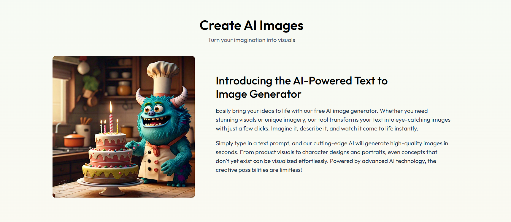

# Imaginate

Imaginate is a web application built with React and Vite for the frontend and Node.js for the backend, designed to provide an interactive and engaging user experience. This project serves as a template for developing modern web applications using the latest technologies.

## Images
Here are some images related to the project:

### Main Screen


### Signup/Login Screen


### Design Overview


## Features
- Fast development with Vite's Hot Module Replacement (HMR)
- ESLint integration for code quality
- Responsive design for various devices

## Cloning or Forking the Repository
To get started with the project, you can either clone or fork the repository:

### Cloning the Repository
1. Open your terminal.
2. Run the following command to clone the repository:
   ```bash
   git clone https://github.com/yourusername/Imaginate.git
   ```
3. Navigate to the project directory:
   ```bash
   cd Imaginate
   ```

### Forking the Repository
1. Go to the [Imaginate GitHub repository](https://github.com/yourusername/Imaginate).
2. Click on the "Fork" button in the top right corner to create a copy of the repository in your GitHub account.
3. Clone your forked repository using the command:
   ```bash
   git clone https://github.com/yourusername/Imaginate.git
   ```

## Installation
After cloning or forking the repository, install the dependencies for both the frontend and backend:

### Frontend
1. Navigate to the client directory:
   ```bash
   cd client
   ```
2. Install the frontend dependencies:
   ```bash
   npm install
   ```

### Backend
1. Navigate to the server directory:
   ```bash
   cd ../server
   ```
2. Install the backend dependencies:
   ```bash
   npm install
   ```

## Running the Project
To run the application in development mode, follow these steps:

### Frontend
1. Navigate to the client directory:
   ```bash
   cd client
   ```
2. Start the frontend application:
   ```bash
   npm run dev
   ```
3. Open your browser and navigate to `http://localhost:3000` to see the frontend application in action.

### Backend
1. Navigate to the server directory:
   ```bash
   cd ../server
   ```
2. Start the backend application:
   ```bash
   node server.js
   ```
3. The backend will be running on the specified port (default is usually 5000).


## License
This project is licensed under the MIT License - see the [LICENSE](LICENSE) file for details.
